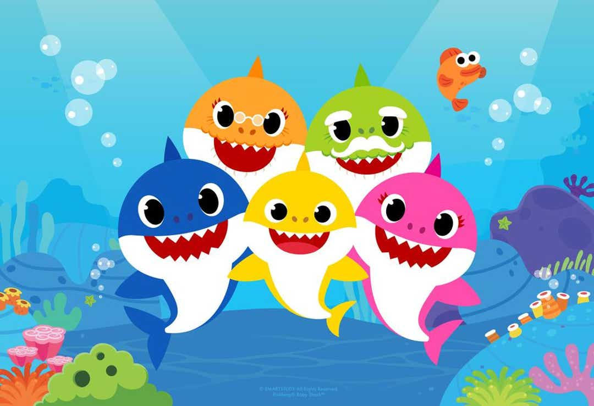

# [Baby shark lyrics generator](https://www.codewars.com/kata/5d076515e102162ac0dc514e)



Create a function, as short as possible, that returns this lyrics.  
Your code should be less than `300` characters. Watch out for the three points at the end of the song.

    Baby shark, doo doo doo doo doo doo
    Baby shark, doo doo doo doo doo doo
    Baby shark, doo doo doo doo doo doo
    Baby shark!
    Mommy shark, doo doo doo doo doo doo
    Mommy shark, doo doo doo doo doo doo
    Mommy shark, doo doo doo doo doo doo
    Mommy shark!
    Daddy shark, doo doo doo doo doo doo
    Daddy shark, doo doo doo doo doo doo
    Daddy shark, doo doo doo doo doo doo
    Daddy shark!
    Grandma shark, doo doo doo doo doo doo
    Grandma shark, doo doo doo doo doo doo
    Grandma shark, doo doo doo doo doo doo
    Grandma shark!
    Grandpa shark, doo doo doo doo doo doo
    Grandpa shark, doo doo doo doo doo doo
    Grandpa shark, doo doo doo doo doo doo
    Grandpa shark!
    Let's go hunt, doo doo doo doo doo doo
    Let's go hunt, doo doo doo doo doo doo
    Let's go hunt, doo doo doo doo doo doo
    Let's go hunt!
    Run away,…

Good Luck!

---

<details><summary>My Solution</summary>

```js
function babySharkLyrics() {
  const g = name => `${name}, doo doo doo doo doo doo\n`.repeat(3) + `${name}!\n`
  return (
    g('Baby shark') +
    g('Mommy shark') +
    g('Daddy shark') +
    g('Grandma shark') +
    g('Grandpa shark') +
    g("Let's go hunt") +
    'Run away,…'
  )
}
```

</details>
