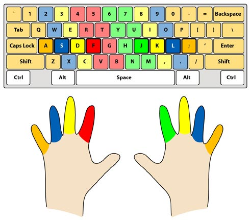

# [Comfortable words](https://www.codewars.com/kata/56684677dc75e3de2500002b)

A comfortable word is a word which you can type always alternating the hand you type with (assuming you type using a
QWERTY keyboard and use fingers as shown in the image below).

That being said, complete the function which receives a word and returns `true` if it's a comfortable word and `false`
otherwise.

The word will always be a string consisting of only ascii letters from `a` to `z`.



To avoid problems with image availability, here's the lists of letters for each hand:

- Left: `q, w, e, r, t, a, s, d, f, g, z, x, c, v, b`
- Right: `y, u, i, o, p, h, j, k, l, n, m`

## Examples

    "yams"  -->  true
    "test"  -->  false

<details><summary>My Solution</summary>

```js
const comfortableWord = word => {
  const left = ['q', 'w', 'e', 'r', 't', 'a', 's', 'd', 'f', 'g', 'z', 'x', 'c', 'v', 'b']
  const right = ['y', 'u', 'i', 'o', 'p', 'h', 'j', 'k', 'l', 'n', 'm']

  for (let i = 0; i < word.length - 1; i++) {
    if (left.includes(word[i]) && left.includes(word[i + 1])) return false
    if (right.includes(word[i]) && right.includes(word[i + 1])) return false
  }

  return true
}
```

</details>
