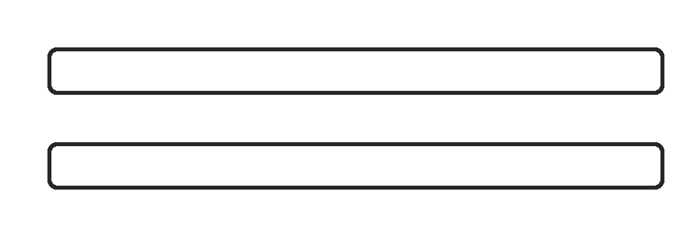

# [Genetic Algorithm Series - #3 Crossover](https://www.codewars.com/kata/567d71b93f8a50f461000019)

In genetic algorithms, crossover is a genetic operator used to vary the programming of chromosomes from one generation
to the next.

The one-point crossover consists in swapping one's cromosome part with another in a specific given point. The image
bellow shows the crossover being applied on chromosomes `1011011001111` and `1011100100110` with the cut point (index)
`4`:



In this kata you have to implement a function `crossover` that receives two chromosomes `chromosome1`, `chromosome2` and
a zero-based `index` and it has to return an array with the crossover result on both chromosomes
`[chromosome1, chromosome2]`.

# Example:

`crossover('111000', '000110', 3)` should return `['111110', 000000']`

# See other katas from this series

- [Genetic Algorithm Series - #1 Generate](http://www.codewars.com/kata/genetic-algorithm-series-number-1-generate)
- [Genetic Algorithm Series - #2 Mutation](http://www.codewars.com/kata/genetic-algorithm-series-number-2-mutation)
- **Genetic Algorithm Series - #3 Crossover**
- [Genetic Algorithm Series - #4 Get population and fitnesses](http://www.codewars.com/kata/genetic-algorithm-series-number-4-get-population-and-fitnesses)
- [Genetic Algorithm Series - #5 Roulette wheel selection](http://www.codewars.com/kata/genetic-algorithm-series-number-5-roulette-wheel-selection)

_This kata is a piece
of  [Binary Genetic Algorithm](http://www.codewars.com/kata/526f35b9c103314662000007)_)

---

<details><summary>My Solution</summary>

```js
const crossover = (chromosome1, chromosome2, index) => {
  let first = chromosome1.slice(0, index) + chromosome2.slice(index, chromosome2.length)
  let second = chromosome2.slice(0, index) + chromosome1.slice(index, chromosome1.length)

  return [first, second]
}
```

</details>
