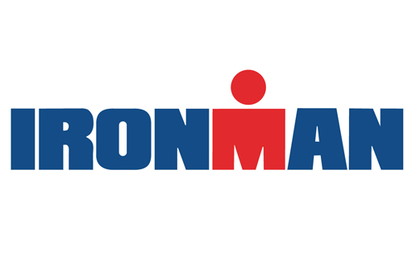

# [Ironman Triathlon](https://www.codewars.com/kata/57d001b405c186ccb6000304)



An Ironman Triathlon is one of a series of long-distance triathlon races organized by the World Triathlon Corporaion (
WTC). It consists of a 2.4-mile swim, a 112-mile bicycle ride and a marathon (26.2-mile) (run, raced in that order and
without a break. It hurts... trust me.

Your task is to take a distance that an athlete is through the race, and return one of the following:

If the distance is zero, return `'Starting Line... Good Luck!'`.

If the athlete will be swimming, return an object with `'Swim'` as the key, and the remaining race distance as the
value.

If the athlete will be riding their bike, return an object with `'Bike'` as the key, and the remaining race distance as
the value.

If the athlete will be running, and has more than 10 miles to go, return an object with `'Run'` as the key, and the
remaining race distance as the value.

If the athlete has 10 miles or less to go, return return an object with `'Run'` as the key, and `'Nearly there!'` as the
value.

Finally, if the athlete has completed te distance, return `"You're done! Stop running!"`.

All distance should be calculated to two decimal places.

---

<details><summary>My Solution</summary>

```js
function iTri(s) {
  if (s === 0) return "Starting Line... Good Luck!";
  if (s >= 140.6) return "You're done! Stop running!";
  if (s < 2.4) return { Swim: `${(140.6 - s).toFixed(2)} to go!` };
  if (s < 114.4) return { Bike: `${(140.6 - s).toFixed(2)} to go!` };
  return {
    Run: s < 130.6 ? `${(140.6 - s).toFixed(2)} to go!` : "Nearly there!",
  };
}
```

</details>
