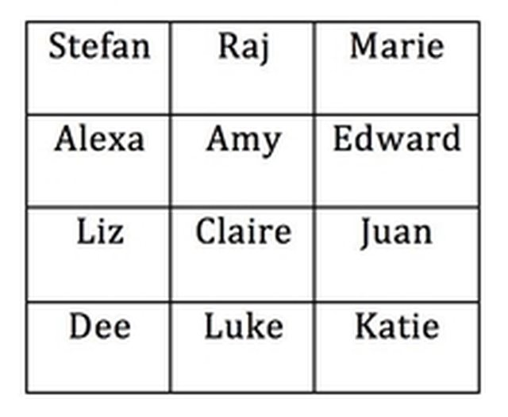
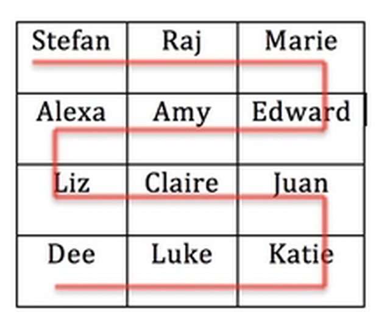

# [The Lazy Startup Office](https://www.codewars.com/kata/578fdcfc75ffd1112c0001a1)

A startup office has an ongoing problem with its bin. Due to low budgets, they don't hire cleaners. As a result, the
staff are left to voluntarily empty the bin. It has emerged that a voluntary system is not working and the bin is often
overflowing. One staff member has suggested creating a rota system based upon the staff seating plan.

Create a function `binRota` that accepts a 2D array of names. The function will return a single array containing staff
names in the order that they should empty the bin.

Adding to the problem, the office has some temporary staff. This means that the seating plan changes every month. Both
staff members' names and the number of rows of seats may change. Ensure that the function `binRota` works when tested
with these changes.

**Notes:**

- All the rows will always be the same length as each other.
- There will be no empty spaces in the seating plan.
- There will be no empty arrays.
- Each row will be at least one seat long.

An example seating plan is as follows:



Or as an array:

    [ ["Stefan", "Raj",    "Marie"],
      ["Alexa",  "Amy",    "Edward"],
      ["Liz",    "Claire", "Juan"],
      ["Dee",    "Luke",   "Katie"] ]

The rota should start with Stefan and end with Dee, taking the left-right zigzag path as illustrated by the red line:



As an output you would expect in this case:

    ["Stefan", "Raj", "Marie", "Edward", "Amy", "Alexa", "Liz", "Claire", "Juan", "Katie", "Luke", "Dee"])

---

<details><summary>My Solution</summary>

```js
function binRota(arr) {
  return arr.reduce((result, cur, i) => {
    return [...result, ...(i % 2 ? cur.reverse() : cur)]
  }, [])
}
```

</details>
