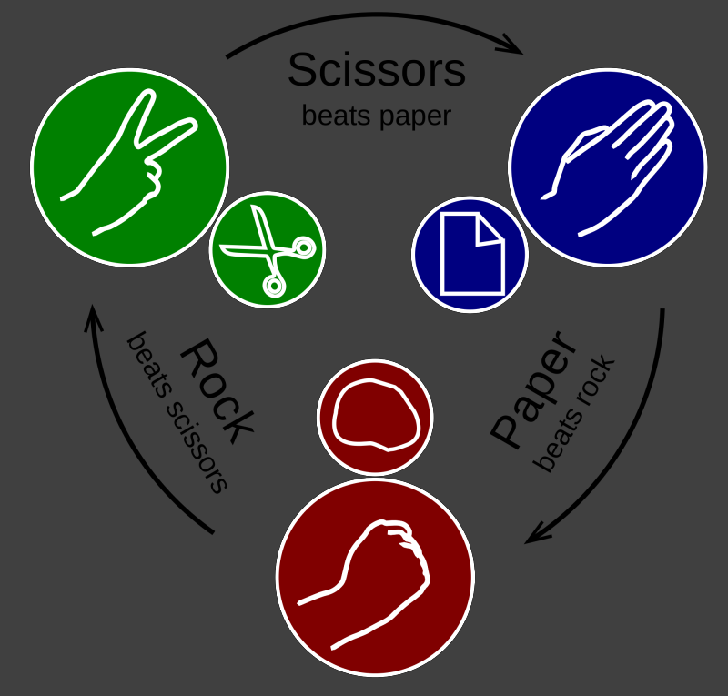

# Codewars Solutions

This is a collection of [my codewars]((https://www.codewars.com/users/TimothyGuo).) solutions.


## 1. [How good are you really?](https://www.codewars.com/kata/5601409514fc93442500010b)

There was a test in your class and you passed it. Congratulations!

But you're an ambitious person. You want to know if you're better than the average student in your class.

You receive an array with your peers' test scores. Now calculate the average and compare your score!

Return `True` if you're better, else `False`!

### Note:
Your points are not included in the array of your class's points. For calculating the average point you may add your point to the given array!

<details><summary>My Solution</summary>

```js
function betterThanAverage(classPoints, yourPoints) {
  return yourPoints > classPoints.reduce((a, b) => a + b, 0) / classPoints.length
}
```
</details>

---

**[⬆ Back to Top](#codewars-solutions)**


## 2. [Remove First and Last Character](https://www.codewars.com/kata/56bc28ad5bdaeb48760009b0)

It's pretty straightforward. Your goal is to create a function that removes the first and last characters of a string. You're given one parameter, the original string. You don't have to worry with strings with less than two characters.

<details><summary>My Solution</summary>

```js
function removeChar(str){
 return str.slice(1, -1)
}
```
</details>

---

**[⬆ Back to Top](#codewars-solutions)**


## 3. [Remove String Spaces](https://www.codewars.com/kata/57eae20f5500ad98e50002c5)

Write a function that removes the spaces from the string, then return the resultant string.

### Examples:

```
Input -> Output
"8 j 8   mBliB8g  imjB8B8  jl  B" -> "8j8mBliB8gimjB8B8jlB"
"8 8 Bi fk8h B 8 BB8B B B  B888 c hl8 BhB fd" -> "88Bifk8hB8BB8BBBB888chl8BhBfd"
"8aaaaa dddd r     " -> "8aaaaaddddr"
```

<details><summary>My Solution</summary>

```js
function noSpace(x){
  return x.replace(/ /g, '')
}
```
</details>

---

**[⬆ Back to Top](#codewars-solutions)**


## 4. [Square(n) Sum](https://www.codewars.com/kata/515e271a311df0350d00000f)

Complete the square sum function so that it squares each number passed into it and then sums the results together.

For example, for `[1, 2, 2]` it should return `9`because 1^2^ + 2^2^ + 2^2^ = 9.

<details><summary>My Solution</summary>

```js
function squareSum(numbers){
  return numbers.reduce((sum, n) => {
    return sum += n**2
  }, 0)
}
```
</details>

---

**[⬆ Back to Top](#codewars-solutions)**


## 5. [Rock Paper Scissors!](https://www.codewars.com/kata/5672a98bdbdd995fad00000f)

Let's play! You have to return which player won! In case of a draw return `Draw`!.

Examples(Input1, Input2 --> Output):
```
"scissors", "paper" --> "Player 1 won!"
"scissors", "rock" --> "Player 2 won!"
"paper", "paper" --> "Draw!"
```


<details><summary>My Solution</summary>

```js
const rps = (p1, p2) => {
  if(p1 === p2) return "Draw!"
  
  const map = {
    rock: "scissors",
    paper: "rock",
    scissors: "paper"
  }
  
  return map[p1] === p2 ? 'Player 1 won!': 'Player 2 won!'
  
}
```
</details>

---

**[⬆ Back to Top](#codewars-solutions)**


## 6. [Complete The Pattern #2](https://www.codewars.com/kata/55733d3ef7c43f8b0700007c)

### Task:
You have to write a function pattern which returns the following Pattern (See Pattern & Examples) upto n number of rows.

- Note: Returning the pattern is not the same as Printing the pattern.
### Rules/Note:
- If n < 1 then it should return "" i.e. empty string.
- There are no whitespaces in the pattern.
### Pattern:
```
(n)(n-1)(n-2)...4321
(n)(n-1)(n-2)...432
(n)(n-1)(n-2)...43
(n)(n-1)(n-2)...4
...............
..............
(n)(n-1)(n-2)
(n)(n-1)
(n)
```
### Examples:
- pattern(4):

```
4321
432
43
4
```
- pattern(11):

```
1110987654321
111098765432
11109876543
1110987654
111098765
11109876
1110987
111098
11109
1110
11
```
- Hint: Use \n in string to jump to next line
<details><summary>My Solution</summary>

```js
function pattern(n){
  let  str = ""
  
  if (n < 1) {
    return str
  } else {
    for (var j = n; j > 0; j--) {
      for (var i = n; i > n - j; i--) {
        str = str.concat(i.toString())
      }
      str = str.concat("\n")
    }

    str = str.slice(0, -1)
    
    return str
  }
}
```
</details>

---

**[⬆ Back to Top](#codewars-solutions)**


## 7. [Gravity Flip](https://www.codewars.com/kata/5f70c883e10f9e0001c89673)

If you've completed this kata already and want a bigger challenge, here's the [3D version](https://www.codewars.com/kata/5f849ab530b05d00145b9495/)

Bob is bored during his physics lessons so he's built himself a toy box to help pass the time. The box is special because it has the ability to change gravity.

There are some columns of toy cubes in the box arranged in a line. The i-th column contains `a_i` cubes. At first, the gravity in the box is pulling the cubes downwards. When Bob switches the gravity, it begins to pull all the cubes to a certain side of the box, `d`, which can be either `'L`' or` 'R'` (left or right). Below is an example of what a box of cubes might look like before and after switching gravity.

```
+---+                                       +---+
|   |                                       |   |
+---+                                       +---+
+---++---+     +---+              +---++---++---+
|   ||   |     |   |   -->        |   ||   ||   |
+---++---+     +---+              +---++---++---+
+---++---++---++---+         +---++---++---++---+
|   ||   ||   ||   |         |   ||   ||   ||   |
+---++---++---++---+         +---++---++---++---+
```

Given the initial configuration of the cubes in the box, find out how many cubes are in each of the n columns after Bob switches the gravity.

### Examples (input -> output:
```
* 'R', [3, 2, 1, 2]      ->  [1, 2, 2, 3]
* 'L', [1, 4, 5, 3, 5 ]  ->  [5, 5, 4, 3, 1]
* 
```

<details><summary>My Solution</summary>

```js
const flip=(d, a)=>{
  const compare = (a, b) => a - b
  return d === 'R' ?  a.sort(compare) : a.sort(compare).reverse()
}
```
</details>

---

**[⬆ Back to Top](#codewars-solutions)**


## 8. [Total amount of points](https://www.codewars.com/kata/5bb904724c47249b10000131)

Our football team has finished the championship.

Our team's match results are recorded in a collection of strings. Each match is represented by a string in the format `"x:y"`, where `x` is our team's score and `y` is our opponents score.

For example: `["3:1", "2:2", "0:1", ...]`

Points are awarded for each match as follows:

- if x > y: 3 points (win)
- if x < y: 0 points (loss)
- if x = y: 1 point (tie)
We need to write a function that takes this collection and returns the number of points our team (`x`) got in the championship by the rules given above.

Notes:

- our team always plays 10 matches in the championship
- 0 <= x <= 4
- 0 <= y <= 4

<details><summary>My Solution</summary>

```js
function points(games) {
  return games.reduce((sum, game) => {
    if (game[0] > game[2]) {
      sum += 3
    } else if (game[0] === game[2]) {
      sum += 1
    }
    
    return sum
  }, 0)
}
```
</details>

---

**[⬆ Back to Top](#codewars-solutions)**


## 9. [Exes and Ohs](https://www.codewars.com/kata/55908aad6620c066bc00002a)

Check to see if a string has the same amount of 'x's and 'o's. The method must return a boolean and be case insensitive. The string can contain any char.

Examples input/output:

```js
XO("ooxx") => true
XO("xooxx") => false
XO("ooxXm") => true
XO("zpzpzpp") => true // when no 'x' and 'o' is present should return true
XO("zzoo") => false
```

<details><summary>My Solution</summary>

```js
function XO(str) {
  return (
    (str.match(/x/gi) && str.match(/x/gi).length) ===
    (str.match(/o/gi) && str.match(/o/gi).length)
  )
}
```
</details>

---

**[⬆ Back to Top](#codewars-solutions)**


## 10. [Ones and Zeros](https://www.codewars.com/kata/578553c3a1b8d5c40300037c)

Given an array of ones and zeroes, convert the equivalent binary value to an integer.

Eg: `[0, 0, 0, 1]` is treated as 0001 which is the binary representation of `1`.

Examples:

```
Testing: [0, 0, 0, 1] ==> 1
Testing: [0, 0, 1, 0] ==> 2
Testing: [0, 1, 0, 1] ==> 5
Testing: [1, 0, 0, 1] ==> 9
Testing: [0, 0, 1, 0] ==> 2
Testing: [0, 1, 1, 0] ==> 6
Testing: [1, 1, 1, 1] ==> 15
Testing: [1, 0, 1, 1] ==> 11
```
However, the arrays can have varying lengths, not just limited to `4`.
<details><summary>My Solution</summary>

```js
const binaryArrayToNumber = arr => {
  return parseInt(arr.join(''), 2)
}
```
</details>

---

**[⬆ Back to Top](#codewars-solutions)**


## 11. [Twice as old](https://www.codewars.com/kata/5b853229cfde412a470000d0)

Your function takes two arguments:

1. current father's age (years)
2. current age of his son (years)

Calculate how many years ago the father was twice as old as his son (or in how many years he will be twice as old). The answer is always greater or equal to 0, no matter if it was in the past or it is in the future.
<details><summary>My Solution</summary>

```js
function twiceAsOld(d, s) {
  return Math.abs(s * 2- d)
}
```
</details>

---

**[⬆ Back to Top](#codewars-solutions)**


## 12. [Two Sum](https://www.codewars.com/kata/52c31f8e6605bcc646000082)

Write a function that takes an array of numbers (integers for the tests) and a target number. It should find two different items in the array that, when added together, give the target value. The indices of these items should then be returned in a tuple / list (depending on your language) like so: (index1, index2).

For the purposes of this kata, some tests may have multiple answers; any valid solutions will be accepted.

The input will always be valid (numbers will be an array of length 2 or greater, and all of the items will be numbers; target will always be the sum of two different items from that array).

```js
twoSum([1, 2, 3], 4) // returns [0, 2] or [2, 0]
```
<details><summary>My Solution</summary>

```js
function twoSum(nums, target) {
  const map = new Map()
  
  for (let i = 0; i < nums.length; i++) {
    const a = nums[i]
    const b = target - a
    
    if (map.has(b)) {
      return [i, map.get(b)]
    } else {
      map.set(a, i)
    }
  }
}
```
</details>

---

**[⬆ Back to Top](#codewars-solutions)**


## 13. [Find the smallest integer in the array](https://www.codewars.com/kata/55a2d7ebe362935a210000b2)

Given an array of integers your solution should find the smallest integer.

For example:

- Given [34, 15, 88, 2] your solution will return 2
- Given [34, -345, -1, 100] your solution will return -345

You can assume, for the purpose of this kata, that the supplied array will not be empty.

<details><summary>My Solution</summary>

```js
class SmallestIntegerFinder {
  findSmallestInt(args) {
    return Math.min(...args)
  }
}
```
</details>

---

**[⬆ Back to Top](#codewars-solutions)**


## 14. [Remove the minimum](https://www.codewars.com/kata/563cf89eb4747c5fb100001b)

The museum of incredible dull things wants to get rid of some exhibitions. Miriam, the interior architect, comes up with a plan to remove the most boring exhibitions. She gives them a rating, and then removes the one with the lowest rating.

However, just as she finished rating all exhibitions, she's off to an important fair, so she asks you to write a program that tells her the ratings of the items after one removed the lowest one. Fair enough.

### Task
Given an array of integers, remove the smallest value. __Do not mutate the original array/list.__ If there are multiple elements with the same value, remove the one with a lower index. If you get an empty array/list, return an empty array/list.

Don't change the order of the elements that are left.

### Examples
```
* Input: [1,2,3,4,5], output = [2,3,4,5]
* Input: [5,3,2,1,4], output = [5,3,2,4]
* Input: [2,2,1,2,1], output = [2,2,2,1]
```
<details><summary>My Solution</summary>

```js
function removeSmallest(nums) {
  const newNums = [...nums]
  const min = Math.min(...newNums)

  newNums.splice(newNums.indexOf(min), 1)

  return newNums
}
```
</details>

---

**[⬆ Back to Top](#codewars-solutions)**


## 15. [Welcome](https://www.codewars.com/kata/577ff15ad648a14b780000e7)

Your start-up's BA has told marketing that your website has a large audience in Scandinavia and surrounding countries. Marketing thinks it would be great to welcome visitors to the site in their own language. Luckily you already use an API that detects the user's location, so this is an easy win.

### The Task
- Think of a way to store the languages as a database. The languages are listed below so you can copy and paste!
- Write a 'welcome' function that takes a parameter 'language', with a type String, and returns a greeting - if you have it in your database. It should default to English if the language is not in the database, or in the event of an invalid input.

### The Database
```
[ ("english", "Welcome")
, ("czech", "Vitejte")
, ("danish", "Velkomst")
, ("dutch", "Welkom")
, ("estonian", "Tere tulemast")
, ("finnish", "Tervetuloa")
, ("flemish", "Welgekomen")
, ("french", "Bienvenue")
, ("german", "Willkommen")
, ("irish", "Failte")
, ("italian", "Benvenuto")
, ("latvian", "Gaidits")
, ("lithuanian", "Laukiamas")
, ("polish", "Witamy")
, ("spanish", "Bienvenido")
, ("swedish", "Valkommen")
, ("welsh", "Croeso")
]
```

Possible invalid inputs include:

```
IP_ADDRESS_INVALID - not a valid ipv4 or ipv6 ip address
IP_ADDRESS_NOT_FOUND - ip address not in the database
IP_ADDRESS_REQUIRED - no ip address was suppliedput: [2,2,1,2,1], output = [2,2,2,1]
```

<details><summary>My Solution</summary>

```js
function greet(language) {
	const languagesDB = {
    english: 'Welcome',
    czech: 'Vitejte',
    danish: 'Velkomst',
    dutch: 'Welkom',
    estonian: 'Tere tulemast',
    finnish: 'Tervetuloa',
    flemish: 'Welgekomen',
    french: 'Bienvenue',
    german: 'Willkommen',
    irish: 'Failte',
    italian: 'Benvenuto',
    latvian: 'Gaidits',
    lithuanian: 'Laukiamas',
    polish: 'Witamy',
    spanish: 'Bienvenido',
    swedish: 'Valkommen',
    welsh: 'Croeso',
  }
  
  return languagesDB[language] || languagesDB['english']
}
```
</details>

---

**[⬆ Back to Top](#codewars-solutions)**


## 16. [Reversed Strings](https://www.codewars.com/kata/5168bb5dfe9a00b126000018)

Complete the solution so that it reverses the string passed into it.
```
'world'  =>  'dlrow'
'word'   =>  'drow'
```

<details><summary>My Solution</summary>

```js
function solution(str){
  return [...str].reverse().join('')
}
```
</details>

---

**[⬆ Back to Top](#codewars-solutions)**


## 17. [Printer Errors](https://www.codewars.com/kata/56541980fa08ab47a0000040)

In a factory a printer prints labels for boxes. For one kind of boxes the printer has to use colors which, for the sake of simplicity, are named with letters from `a` to `m`.

The colors used by the printer are recorded in a control string. For example a "good" control string would be `aaabbbbhaijjjm` meaning that the printer used three times color a, four times color b, one time color h then one time color a...

Sometimes there are problems: lack of colors, technical malfunction and a "bad" control string is produced e.g. `aaaxbbbbyyhwawiwjjjwwm` with letters not from `a to m`.

You have to write a function `printer_error` which given a string will return the error rate of the printer as a string representing a rational whose numerator is the number of errors and the denominator the length of the control string. Don't reduce this fraction to a simpler expression.

The string has a length greater or equal to one and contains only letters from `a` to `z`.

Examples:
```
s="aaabbbbhaijjjm"
printer_error(s) => "0/14"

s="aaaxbbbbyyhwawiwjjjwwm"
printer_error(s) => "8/22"
```

<details><summary>My Solution</summary>

```js
function printerError(s) {
    return `${s.replace(/[a-m]/g, '').length}/${s.length}`
}
```
</details>

---

**[⬆ Back to Top](#codewars-solutions)**


## 18. [Create Phone Mumber](https://www.codewars.com/kata/525f50e3b73515a6db000b83)

Write a function that accepts an array of 10 integers (between 0 and 9), that returns a string of those numbers in the form of a phone number.

Example
```js
createPhoneNumber([1, 2, 3, 4, 5, 6, 7, 8, 9, 0]) // => returns "(123) 456-7890"
```
The returned format must be correct in order to complete this challenge.

Don't forget the space after the closing parentheses!

<details><summary>My Solution</summary>

```js
function createPhoneNumber(numbers){
  return numbers.reduce((p, c) => {
    return p.replace('x', c)
  }, '(xxx) xxx-xxxx')
}
```
</details>

---

**[⬆ Back to Top](#codewars-solutions)**

## 19. [Bit Counting](https://www.codewars.com/kata/526571aae218b8ee490006f4)

Write a function that takes an integer as input, and returns the number of bits that are equal to one in the binary representation of that number. You can guarantee that input is non-negative.

Example: The binary representation of `1234` is `10011010010`, so the function should return `5` in this case

<details><summary>My Solution</summary>

```js
const countBits = function(n) {
  return n.toString(2).replace(/0/g, '').length
}
```
</details>

---

**[⬆ Back to Top](#codewars-solutions)**

## 20. [WeIrD StRiNg CaSe](https://www.codewars.com/kata/52b757663a95b11b3d00062d)

Write a function that accepts a string, and returns the same string with all even indexed characters in each word upper cased, and all odd indexed characters in each word lower cased. The indexing just explained is zero based, so the zero-ith index is even, therefore that character should be upper cased and you need to start over for each word.

The passed in string will only consist of alphabetical characters and spaces(`' '`). Spaces will only be present if there are multiple words. Words will be separated by a single space(`' `').

### Examples:
```
"String" => "StRiNg"
"Weird string case" => "WeIrD StRiNg CaSe"
```

<details><summary>My Solution</summary>

```js
function toWeirdCase(string) {
  return string
    .split(' ')
    .map(word => {
      return word
        .split('')
        .map((char, index) => {
          return index % 2 === 0 ? char.toUpperCase() : char.toLowerCase()
        })
        .join('')
    })
    .join(' ')
}
```
</details>

---

**[⬆ Back to Top](#codewars-solutions)**


## 21. [Your Order, please](https://www.codewars.com/kata/55c45be3b2079eccff00010f)

Your task is to sort a given string. Each word in the string will contain a single number. This number is the position the word should have in the result.

Note: Numbers can be from 1 to 9. So 1 will be the first word (not 0).

If the input string is empty, return an empty string. The words in the input String will only contain valid consecutive numbers.

### Examples
```
"is2 Thi1s T4est 3a"  -->  "Thi1s is2 3a T4est"
"4of Fo1r pe6ople g3ood th5e the2"  -->  "Fo1r the2 g3ood 4of th5e pe6ople"
""  -->  ""
```
<details><summary>My Solution</summary>

```js
function order(words){
 return words
    .split(' ')
    .sort((a, b) => {
      return a.match(/\d/, '') - b.match(/\d/, '')
    })
    .join(' ')
}
```
</details>

---

**[⬆ Back to Top](#codewars-solutions)**


## 22. [Shortest word](https://www.codewars.com/kata/57cebe1dc6fdc20c57000ac9)

Simple, given a string of words, return the length of the shortest word(s).

String will never be empty and you do not need to account for different data types.

<details><summary>My Solution</summary>

```js
function findShort(s){
  return Math.min(
    ...s.split(' ') // array
    .map(word => word.length)
  )
}
```
</details>

---

**[⬆ Back to Top](#codewars-solutions)**


## 23. [Friend or Foe?](https://www.codewars.com/kata/55b42574ff091733d900002f)

Make a program that filters a list of strings and returns a list with only your friends name in it.

If a name has exactly 4 letters in it, you can be sure that it has to be a friend of yours! Otherwise, you can be sure he's not...

Ex: Input = ["Ryan", "Kieran", "Jason", "Yous"], Output = ["Ryan", "Yous"]

i.e.

```js
friend ["Ryan", "Kieran", "Mark"] `shouldBe` ["Ryan", "Mark"]
```
Note: keep the original order of the names in the output.

<details><summary>My Solution</summary>

```js
function friend(friends) {
  return friends.filter(name => name.length === 4)
}
```
</details>

---

**[⬆ Back to Top](#codewars-solutions)**


## 24. [Replace With Alphabet Position](https://www.codewars.com/kata/546f922b54af40e1e90001da)

Welcome.

In this kata you are required to, given a string, replace every letter with its position in the alphabet.

If anything in the text isn't a letter, ignore it and don't return it.

`"a" = 1`, `"b" = 2`, etc.

### Example
```js
alphabetPosition("The sunset sets at twelve o' clock.")
```
Should return `"20 8 5 19 21 14 19 5 20 19 5 20 19 1 20 20 23 5 12 22 5 15 3 12 15 3 11"` ( as a string )

<details><summary>My Solution</summary>

```js
function alphabetPosition(text) {
  return text
    .toUpperCase()
    .replace(/[^A-Z]/g, '')
    .split('')
    .map(char => char.charCodeAt() - 64 )
    .join(' ')
}
```
</details>

---

**[⬆ Back to Top](#codewars-solutions)**


## 25. [Count characters in your string](https://www.codewars.com/kata/52efefcbcdf57161d4000091)

The main idea is to count all the occurring characters in a string. If you have a string like `aba`, then the result should be `{'a': 2, 'b': 1}`.

What if the string is empty? Then the result should be empty object literal, `{}`.
<details><summary>My Solution</summary>

```js
function count (string) {  
  // 1. Create an empty object {}
  // 2. Use character as key, count as value
  
  // 3. Go trhough each character in the givin string, ++count if already exist or initialize it (count = 1)
  return [...string].reduce((a,b) => {
    a[b] ? a[b]++ : a[b] = 1
    
    return a
  }, {})
}
```
</details>

---

**[⬆ Back to Top](#codewars-solutions)**


## 26. [Counting Duplicates](https://www.codewars.com/kata/54bf1c2cd5b56cc47f0007a1)

### Count the number of Duplicates
Write a function that will return the count of distinct case-insensitive alphabetic characters and numeric digits that occur more than once in the input string. The input string can be assumed to contain only alphabets (both uppercase and lowercase) and numeric digits.

### Example
"abcde" -> 0 `# no characters repeats more than once`
"aabbcde" -> 2 `# 'a' and 'b'`
"aabBcde" -> 2 `# 'a' occurs twice and 'b' twice (`b` and `B`)`
"indivisibility" -> 1 `# 'i' occurs six times`
"Indivisibilities" -> 2 `# 'i' occurs seven times and 's' occurs twice`
"aA11" -> 2 `# 'a' and '1'`
"ABBA" -> 2 `# 'A' and 'B' each occur twice`

<details><summary>My Solution</summary>

```js
function duplicateCount(text){
  return [...text.toUpperCase()].reduce((a, b) => {
    a[b] ? a[b]++ : a[b] = 1
    if(a[b] === 2) a.count++
    
    return a 
  }, { count: 0 }).count
}
```
</details>

---

**[⬆ Back to Top](#codewars-solutions)**


## 27. [Break camelCase](https://www.codewars.com/kata/5208f99aee097e6552000148)

Complete the solution so that the function will break up camel casing, using a space between words.

### Example
```
"camelCasing"  =>  "camel Casing"
"identifier"   =>  "identifier"
""             =>  ""
```

<details><summary>My Solution</summary>

```js
function solution(string) {
    return string.replace(/[A-Z]/g, a => {
      return ` ${a}`
    })
}
```
</details>

---

**[⬆ Back to Top](#codewars-solutions)**


## 28. [Highest and Lowest](https://www.codewars.com/kata/554b4ac871d6813a03000035)

In this little assignment you are given a string of space separated numbers, and have to return the highest and lowest number.

### Examples
```js
highAndLow("1 2 3 4 5");  // return "5 1"
highAndLow("1 2 -3 4 5"); // return "5 -3"
highAndLow("1 9 3 4 -5"); // return "9 -5"
```
### Notes
- All numbers are valid Int32, no need to validate them.
- There will always be at least one number in the input string.
- Output string must be two numbers separated by a single space, and highest number is first.

<details><summary>My Solution</summary>

```js
function highAndLow(numbers){
  const sortedNumbers = numbers.split(' ').sort((a, b) => {
    return parseFloat(a) - parseFloat(b)
  })
  
  return `${sortedNumbers[sortedNumbers.length - 1]} ${sortedNumbers[0]}`
}
```
</details>

---

**[⬆ Back to Top](#codewars-solutions)**


## 29. [Find the first non-consecutive number](https://www.codewars.com/kata/58f8a3a27a5c28d92e000144)

Your task is to find the first element of an array that is not consecutive.

By not consecutive we mean not exactly 1 larger than the previous element of the array.

E.g. If we have an array `[1,2,3,4,6,7,8]` then `1` then `2` then `3` then `4` are all consecutive but `6` is not, so that's the first non-consecutive number.

If the whole array is consecutive then return `null`.

The array will always have at least `2` elements and all elements will be numbers. The numbers will also all be unique and in ascending order. The numbers could be positive or negative and the first non-consecutive could be either too!

<details><summary>My Solution</summary>

```js
function firstNonConsecutive (arr) {
  for(let i = 1; i < arr.length; i++) {
    if(arr[i] - arr[i - 1] !== 1) {
      return arr[i]
    }
  }
  return null
}
```
</details>

---

**[⬆ Back to Top](#codewars-solutions)**


## 30. [Categorize New Member](https://www.codewars.com/kata/5502c9e7b3216ec63c0001aa)

The Western Suburbs Croquet Club has two categories of membership, Senior and Open. They would like your help with an application form that will tell prospective members which category they will be placed.

To be a senior, a member must be at least 55 years old and have a handicap greater than 7. In this croquet club, handicaps range from -2 to +26; the better the player the lower the handicap.

### Input
Input will consist of a list of pairs. Each pair contains information for a single potential member. Information consists of an integer for the person's age and an integer for the person's handicap.

### Output
Output will consist of a list of string values (in Haskell and C: Open or Senior) stating whether the respective member is to be placed in the senior or open category.

### Examples
```js
input =  [[18, 20], [45, 2], [61, 12], [37, 6], [21, 21], [78, 9]]
output = ["Open", "Open", "Senior", "Open", "Open", "Senior"]
```
<details><summary>My Solution</summary>

```js
function openOrSenior(data){
  return data.map(person => {
    return (person[0] > 54 && person[1] > 7) ? 'Senior' : 'Open'
  })
}
```
</details>

---

**[⬆ Back to Top](#codewars-solutions)**


## 31. [Sum of the first nth term of Series](https://www.codewars.com/kata/555eded1ad94b00403000071)

### Task:
Your task is to write a function which returns the sum of following series upto nth term(parameter).

```
Series: 1 + 1/4 + 1/7 + 1/10 + 1/13 + 1/16 +...
```
### Rules:
- You need to round the answer to 2 decimal places and return it as String.
- If the given value is 0 then it should return 0.00
- You will only be given Natural Numbers as arguments.

### Examples:(Input --> Output)
```
1 --> 1 --> "1.00"
2 --> 1 + 1/4 --> "1.25"
5 --> 1 + 1/4 + 1/7 + 1/10 + 1/13 --> "1.57"
```

<details><summary>My Solution</summary>

```js
const SeriesSum = n => {
  let sum = 0
  
  for(let i = 0; i < n; i++) {
    sum += 1 / (i * 3 + 1)
  }
    
  return sum.toFixed(2)
}
```
</details>

---

**[⬆ Back to Top](#codewars-solutions)**


## 32. [Reversed sequence](https://www.codewars.com/kata/5a00e05cc374cb34d100000d)

Build a function that returns an array of integers from n to 1 where n>0.

Example :  `n=5` --> `[5,4,3,2,1]`

<details><summary>My Solution</summary>

```js
const reverseSeq = n => {
  let seq = []
  
  while(n > 0) {
    seq.push(n)
    n--
  }

  return seq;
}
```
</details>

---

**[⬆ Back to Top](#codewars-solutions)**


## 33. [Grasshopper - Grade book](https://www.codewars.com/kata/55cbd4ba903825f7970000f5)

### Grade book

Complete the function so that it finds the average of the three scores passed to it and returns the letter value associated with that grade.

Numerical Score  | Letter Grade
------------- | -------------
90 <= score <= 100  | 'A'
80 <= score <= 90  | 'B'
70 <= score <= 80  | 'C'
60 <= score <= 70  | 'D'

Tested values are all between 0 and 100. Theres is no need to check for negative values or values greater than 100.
<details><summary>My Solution</summary>

```js
function getGrade (s1, s2, s3) {
  let a = (s1 + s2 + s3) / 3
  
  if(a >= 90) return 'A'
  else if(a >= 80) return 'B'
  else if(a >= 70) return 'C'
  else if(a >= 60) return 'D'
  else return 'F'
}
```
</details>

---

**[⬆ Back to Top](#codewars-solutions)**


## 34. [Two to One](https://www.codewars.com/kata/5656b6906de340bd1b0000ac)

Take 2 strings s1 and s2 including only letters from `a` to `z`. Return a new sorted string, the longest possible, containing distinct letters - each taken only once - coming from s1 or s2.

### Examples:
```js
a = "xyaabbbccccdefww"
b = "xxxxyyyyabklmopq"
longest(a, b) -> "abcdefklmopqwxy"

a = "abcdefghijklmnopqrstuvwxyz"
longest(a, a) -> "abcdefghijklmnopqrstuvwxyz"
```

<details><summary>My Solution</summary>

```js
function longest(s1, s2) {
  return [...new Set(s1 + s2)].sort().join('')
}
```
</details>

---

**[⬆ Back to Top](#codewars-solutions)**


## 35. [Count the smiley faces!](https://www.codewars.com/kata/583203e6eb35d7980400002a)

Given an array (arr) as an argument complete the function countSmileys that should return the total number of smiling faces.

Rules for a smiling face:

- Each smiley face must contain a valid pair of eyes. Eyes can be marked as `:` or `;`;
- A smiley face can have a nose but it does not have to. Valid characters for a nose are `-` or `~`
- Every smiling face must have a smiling mouth that should be marked with either `)` or `D`

No additional characters are allowed except for those mentioned.

Valid smiley face examples: `:) :D ;-D :~)`
Invalid smiley faces: `;( :> :} :]`

### Example
```js
countSmileys([':)', ';(', ';}', ':-D']);       // should return 2;
countSmileys([';D', ':-(', ':-)', ';~)']);     // should return 3;
countSmileys([';]', ':[', ';*', ':$', ';-D']); // should return 1;
```
### Note
In case of an empty array return 0. You will not be tested with invalid input (input will always be an array). Order of the face (eyes, nose, mouth) elements will always be the same.
<details><summary>My Solution</summary>

```js
function countSmileys(arr) {
  return arr.filter(x => /[:;][-~]?[)D]/.test(x)).length
}
```
</details>

---

**[⬆ Back to Top](#codewars-solutions)**


## 36. [Convert number to reversed array of digits](https://www.codewars.com/kata/5583090cbe83f4fd8c000051)

Convert number to reversed array of digits
Given a random non-negative number, you have to return the digits of this number within an array in reverse order.

### Example(Input => Output):

```
35231 => [1,3,2,5,3]
0 => [0]
```

<details><summary>My Solution</summary>

```js
function digitize(n) {
  return String(n).split('').map(a => Number(a)).reverse()
}
```
</details>

---

**[⬆ Back to Top](#codewars-solutions)**


## 37. [Playing with digits](https://www.codewars.com/kata/5552101f47fc5178b1000050)

Some numbers have funny properties. For example:

- 89 --> 8¹ + 9² = 89 * 1
- 695 --> 6² + 9³ + 5⁴= 1390 = 695 * 2
- 46288 --> 4³ + 6⁴+ 2⁵ + 8⁶ + 8⁷ = 2360688 = 46288 * 51


- Given two positive integers `n` and `p`, we want to find a positive integer `k`, if it exists, such that the sum of the digits of `n` raised to consecutive powers starting from p is equal to `k * n`.

In other words, writing the consecutive digits of `n` as `a, b, c, d ..`., is there an integer `k` such that :
(a^p^ + b^p+1^ + c^p+2^ + d^p+4^ +...)=n∗k
If it is the case we will return `k`, if not return `-1`.

Note: `n` and `p` will always be strictly positive integers.

### Examples:
```
n = 89; p = 1 ---> 1 since 8¹ + 9² = 89 = 89 * 1

n = 92; p = 1 ---> -1 since there is no k such that 9¹ + 2² equals 92 * k

n = 695; p = 2 ---> 2 since 6² + 9³ + 5⁴= 1390 = 695 * 2

n = 46288; p = 3 ---> 51 since 4³ + 6⁴+ 2⁵ + 8⁶ + 8⁷ = 2360688 = 46288 * 51
```

<details><summary>My Solution</summary>

```js
function digPow(n, p){
 let sum = String(n).split('').reduce((a,b, i) => {
    a += Number(b) ** (p + i)
     
    return a 
  }, 0)
 
 return Number.isInteger(sum / n) ? sum / n : -1
}
```
</details>

---

**[⬆ Back to Top](#codewars-solutions)**


## 38. [Growth of a Population](https://www.codewars.com/kata/563b662a59afc2b5120000c6)

In a small town the population is p0 = 1000 at the beginning of a year. The population regularly increases by 2 percent per year and moreover 50 new inhabitants per year come to live in the town. How many years does the town need to see its population greater than or equal to p = 1200 inhabitants?

```
At the end of the first year there will be: 
1000 + 1000 * 0.02 + 50 => 1070 inhabitants

At the end of the 2nd year there will be: 
1070 + 1070 * 0.02 + 50 => 1141 inhabitants (** number of inhabitants is an integer **)

At the end of the 3rd year there will be:
1141 + 1141 * 0.02 + 50 => 1213

It will need 3 entire years.
```
More generally given parameters:

`p0, percent, aug (inhabitants coming or leaving each year), p (population to equal or surpass)`

the function `nb_year` should return `n` number of entire years needed to get a population greater or equal to `p`.

aug is an integer, percent a positive or null floating number, p0 and p are positive integers (> 0)

Examples:
```
nb_year(1500, 5, 100, 5000) -> 15
nb_year(1500000, 2.5, 10000, 2000000) -> 10
```
### Note:
- Don't forget to convert the percent parameter as a percentage in the body of your function: if the parameter percent is 2 you have to convert it to 0.02.

- There are no fractions of people. At the end of each year, the population count is an integer: `252.8` people round down to `252` persons. 
- 
<details><summary>My Solution</summary>

```js
function nbYear(p0, percent, aug, p) {
  let count = 0
  
  while(p0 < p) {
    p0 = Math.floor(p0 * (1 + percent / 100) + aug)
    count++
  }

  return count
}
```
</details>

---

**[⬆ Back to Top](#codewars-solutions)**


## 39. [Mumbling](https://www.codewars.com/kata/5667e8f4e3f572a8f2000039)

This time no story, no theory. The examples below show you how to write function `accum`:

### Examples:
```js
accum("abcd") -> "A-Bb-Ccc-Dddd"
accum("RqaEzty") -> "R-Qq-Aaa-Eeee-Zzzzz-Tttttt-Yyyyyyy"
accum("cwAt") -> "C-Ww-Aaa-Tttt"
```
The parameter of accum is a string which includes only letters from `a..z` and `A..Z`.

<details><summary>My Solution</summary>

```js
function accum(s) {
	return [...s].map((element, index) => {
        return element.toUpperCase() + element.repeat(index).toLowerCase()
  }).join('-')
}
```
</details>

---

**[⬆ Back to Top](#codewars-solutions)**


## 40. [Equal Sides Of An Array](https://www.codewars.com/kata/5679aa472b8f57fb8c000047)

You are going to be given an array of integers. Your job is to take that array and find an index N where the sum of the integers to the left of N is equal to the sum of the integers to the right of N. If there is no index that would make this happen, return `-1`.

### For example:

Let's say you are given the array `{1,2,3,4,3,2,1}`:
Your function will return the index 3, because at the 3rd position of the array, the sum of left side of the index (`{1,2,3}`) and the sum of the right side of the index (`{3,2,1}`) both equal `6`.

Let's look at another one.
You are given the array `{1,100,50,-51,1,1}`:
Your function will return the index `1`, because at the 1st position of the array, the sum of left side of the index (`{1}`) and the sum of the right side of the index (`{50,-51,1,1}`) both equal `1`.

Last one:
You are given the array `{20,10,-80,10,10,15,35}`
At index 0 the left side is `{}`
The right side is `{10,-80,10,10,15,35}`
They both are equal to `0` when added. (Empty arrays are equal to 0 in this problem)
Index 0 is the place where the left side and right side are equal.

Note: Please remember that in most programming/scripting languages the index of an array starts at 0.

### Input:
An integer array of length `0 < arr < 1000`. The numbers in the array can be any integer positive or negative.

### Output:
The lowest index `N` where the side to the left of `N` is equal to the side to the right of `N`. If you do not find an index that fits these rules, then you will return `-1`.

### Note:
If you are given an array with multiple answers, return the lowest correct index.
<details><summary>My Solution</summary>

```js
const findEvenIndex = arr => {
  const sum = (from, to) => {
    return arr.slice(from, to).reduce((a, b) => a + b, 0)
  }
  
  return arr.findIndex((el, i) => {
    return sum(0, i) === sum(i + 1, arr.length)
  })
}
```
</details>

---

**[⬆ Back to Top](#codewars-solutions)**


## 41. [Descending Order](https://www.codewars.com/kata/5467e4d82edf8bbf40000155)

Your task is to make a function that can take any non-negative integer as an argument and return it with its digits in descending order. Essentially, rearrange the digits to create the highest possible number.

### Examples:
Input: `42145` Output: `54421`
Input: `145263` Output: `654321`
Input: `123456789` Output: `987654321`

<details><summary>My Solution</summary>

```js
function descendingOrder(n){
  return Number([...String(n)].sort().reverse().join(''))
}
```
</details>

---

**[⬆ Back to Top](#codewars-solutions)**


## 42. [Delete occurrences of an element if it occurs more than n times](https://www.codewars.com/kata/554ca54ffa7d91b236000023)

### Enough is enough!
Alice and Bob were on a holiday. Both of them took many pictures of the places they've been, and now they want to show Charlie their entire collection. However, Charlie doesn't like these sessions, since the motif usually repeats. He isn't fond of seeing the Eiffel tower 40 times.
He tells them that he will only sit for the session if they show the same motif at most `N` times. Luckily, Alice and Bob are able to encode the motif as a number. Can you help them to remove numbers such that their list contains each number only up to `N` times, without changing the order?

### Task
Given a list and a number, create a new `list` that contains each number of list at most `N` times, without reordering.
For example if the input number is `2`, and the input list is `[1,2,3,1,2,1,2,3]`, you take `[1,2,3,1,2]`, drop the next `[1,2]` since this would lead to `1` and `2` being in the result `3` times, and then take `3`, which leads to `[1,2,3,1,2,3]`.
With list `[20,37,20,21]` and number 1, the result would be `[20,37,21]`.

<details><summary>My Solution</summary>

```js
function deleteNth(arr,n){
  let map = {}

  return arr.filter(e => {
    map[e] = map[e] ? map[e] + 1 : 1
    return map[e] <= n
  })
}
```
</details>

---

**[⬆ Back to Top](#codewars-solutions)**


## 43. [List Filtering](https://www.codewars.com/kata/53dbd5315a3c69eed20002dd)

In this kata you will create a function that takes a list of non-negative integers and strings and returns a new list with the strings filtered out.

### Example

```js
filter_list([1,2,'a','b']) == [1,2]
filter_list([1,'a','b',0,15]) == [1,0,15]
filter_list([1,2,'aasf','1','123',123]) == [1,2,123]
```

<details><summary>My Solution</summary>

```js
function filter_list(l) {
  return l.filter(e => {
    return typeof e === 'number'
  })
}
```
</details>

---

**[⬆ Back to Top](#codewars-solutions)**


## 44. [Consecutive strings](https://www.codewars.com/kata/56a5d994ac971f1ac500003e)

You are given an array(list) strarr of strings and an integer `k`. Your task is to return the first longest string consisting of k consecutive strings taken in the array.

### Examples:
```
strarr = ["tree", "foling", "trashy", "blue", "abcdef", "uvwxyz"], k = 2

Concatenate the consecutive strings of strarr by 2, we get:

treefoling   (length 10)  concatenation of strarr[0] and strarr[1]
folingtrashy ("      12)  concatenation of strarr[1] and strarr[2]
trashyblue   ("      10)  concatenation of strarr[2] and strarr[3]
blueabcdef   ("      10)  concatenation of strarr[3] and strarr[4]
abcdefuvwxyz ("      12)  concatenation of strarr[4] and strarr[5]

Two strings are the longest: "folingtrashy" and "abcdefuvwxyz".
The first that came is "folingtrashy" so 
longest_consec(strarr, 2) should return "folingtrashy".

In the same way:
longest_consec(["zone", "abigail", "theta", "form", "libe", "zas", "theta", "abigail"], 2) --> "abigailtheta"
```
n being the length of the string array, if `n = 0` or` k > n` or `k <= 0` return "" (return `Nothing` in Elm, "nothing" in Erlang).

### Note
consecutive strings : follow one after another without an interruption
<details><summary>My Solution</summary>

```js
function longestConsec(arr, k) {
  if (arr === [] || k > arr.length || k <= 0) return ''
  
  let consecStr = ''
  let longestStr = ''
  
  for(let i = 0; i <= arr.length - k; i++) {
    consecStr = arr.slice(i, i + k)
    
    if(consecStr.join('').length > longestStr.length) {
      longestStr = consecStr.join('')
     }
  }
  
  return longestStr
}
```
</details>

---

**[⬆ Back to Top](#codewars-solutions)**


## 45. [String ends with?](https://www.codewars.com/kata/51f2d1cafc9c0f745c00037d)

Complete the solution so that it returns true if the first argument(string) passed in ends with the 2nd argument (also a string).

### Examples:

```js
solution('abc', 'bc') // returns true
solution('abc', 'd') // returns false
```

<details><summary>My Solution</summary>

```js
function removeChar(str){
 return str.slice(1, -1)
}
```
</details>

---

**[⬆ Back to Top](#codewars-solutions)**


## 46. [If you can't sleep, just count sheep!!](https://www.codewars.com/kata/5b077ebdaf15be5c7f000077)

If you can't sleep, just count sheep!!

### Task:
Given a non-negative integer, `3` for example, return a string with a murmur: `"1 sheep...2 sheep...3 sheep..."`. Input will always be valid, i.e. no negative integers.
<details><summary>My Solution</summary>

```js
const countSheep = function (num){
  let countSheep = ''
  
  for(let i = 1; i < num + 1; i++) {
    countSheep += `${i} sheep...`
  }
  
  return countSheep
}
```
</details>

---

**[⬆ Back to Top](#codewars-solutions)**


## 47. [Count of positives / sum of negatives](https://www.codewars.com/kata/576bb71bbbcf0951d5000044/javascript)

Given an array of integers.

Return an array, where the first element is the count of positives numbers and the second element is sum of negative numbers. 0 is neither positive nor negative.

If the input is an empty array or is null, return an empty array.

### Example
For input `[1, 2, 3, 4, 5, 6, 7, 8, 9, 10, -11, -12, -13, -14, -15]`, you should return `[10, -65]`.

<details><summary>My Solution</summary>

```js
function countPositivesSumNegatives(input) {
  if (input == null || input.length < 1) {
    return []
  }

  let positiveCount = input.filter(v => v > 0).length
  let negativeSum = input.reduce((a, b) => {
    if (b < 0) {
      a += b
    }

    return a
  }, 0)

  return [positiveCount, negativeSum]
}
```
</details>

---

**[⬆ Back to Top](#codewars-solutions)**


## 48. [Abbreviate a Two Word Name](https://www.codewars.com/kata/57eadb7ecd143f4c9c0000a3)

Write a function to convert a name into initials. This kata strictly takes two words with one space in between them.

The output should be two capital letters with a dot separating them.

It should look like this:

`Sam Harris` => `S.H`

`patrick feeney` => `P.F`

<details><summary>My Solution</summary>

```js
function abbrevName(name){
  let nameArray = name.toUpperCase().split(' ')
   return `${nameArray[0].charAt(0)}.${nameArray[1].charAt(0)}`
}
```
</details>

---

**[⬆ Back to Top](#codewars-solutions)**


## 49. [Are You Playing Banjo?](https://www.codewars.com/kata/53af2b8861023f1d88000832)

Create a function which answers the question "Are you playing banjo?".
If your name starts with the letter "R" or lower case "r", you are playing banjo!

The function takes a name as its only argument, and returns one of the following strings:

```
name + " plays banjo" 
name + " does not play banjo"
```
Names given are always valid strings.

<details><summary>My Solution</summary>

```js
function areYouPlayingBanjo(name) {
  if(name.startsWith('R') || name.startsWith('r')) {
    return `${name} plays banjo`
  }
  
  return `${name} does not play banjo`
}
```
</details>

---

**[⬆ Back to Top](#codewars-solutions)**


## 50. [Count the divisors of a number](https://www.codewars.com/kata/542c0f198e077084c0000c2e)

Count the number of divisors of a positive integer `n`.

Random tests go up to `n = 500000`.

### Examples (input --> output)
```
4 --> 3 // we have 3 divisors - 1, 2 and 4
5 --> 2 // we have 2 divisors - 1 and 5
12 --> 6 // we have 6 divisors - 1, 2, 3, 4, 6 and 12
30 --> 8 // we have 8 divisors - 1, 2, 3, 5, 6, 10, 15 and 30
```
Note you should only return a number, the count of divisors. The numbers between parentheses are shown only for you to see which numbers are counted in each case.

<details><summary>My Solution</summary>

```js
function getDivisorsCnt(n){
    let count = 0
    
    for(let i = 1; i <= n; i++) {
      if(!(n % i)) count++
    }
  
  return count
}
```
</details>

---

**[⬆ Back to Top](#codewars-solutions)**


## 51. [You're a square!](https://www.codewars.com/kata/54c27a33fb7da0db0100040e)

### A square of squares
You like building blocks. You especially like building blocks that are squares. And what you even like more, is to arrange them into a square of square building blocks!

However, sometimes, you can't arrange them into a square. Instead, you end up with an ordinary rectangle! Those blasted things! If you just had a way to know, whether you're currently working in vain… Wait! That's it! You just have to check if your number of building blocks is a perfect square.

### Task
Given an integral number, determine if it's a [square number](https://en.wikipedia.org/wiki/Square_number):

> In mathematics, a square number or perfect square is an integer that is the square of an integer; in other words, it is the product of some integer with itself.

The tests will always use some integral number, so don't worry about that in dynamic typed languages.

### Examples
```
-1  =>  false
 0  =>  true
 3  =>  false
 4  =>  true
25  =>  true
26  =>  false
```

<details><summary>My Solution</summary>

```js
const isSquare = function(n){
  return Math.sqrt(n) % 1 === 0
}
```
</details>

---

**[⬆ Back to Top](#codewars-solutions)**


## 52. [Vowel Count](https://www.codewars.com/kata/54ff3102c1bad923760001f3)

Return the number (count) of vowels in the given string.

We will consider `a`, `e`, `i`, `o`, `u` as vowels for this Kata (but not `y`).

The input string will only consist of lower case letters and/or spaces.

<details><summary>My Solution</summary>

```js
function getCount(str) {
  return str.match(/[aeiou]/g) ? str.match(/[aeiou]/g).length : 0
}
```
</details>

---

**[⬆ Back to Top](#codewars-solutions)**


## 53. [Find the stray number](https://www.codewars.com/kata/57f609022f4d534f05000024)

You are given an odd-length array of integers, in which all of them are the same, except for one single number.

Complete the method which accepts such an array, and returns that single different number.

The input array will always be valid! (odd-length >= 3)

### Examples
```
[1, 1, 2] ==> 2
[17, 17, 3, 17, 17, 17, 17] ==> 3
```

<details><summary>My Solution</summary>

```js
function stray(numbers) {
  if(numbers[0] === numbers[1]) {
    return numbers.find( v => v !== numbers[0])
  }
  
  return numbers[0] === numbers[2] ? numbers[1] : numbers[0]
}
```
</details>

---

**[⬆ Back to Top](#codewars-solutions)**


## 54. [Google Dorking - Validating Queries](https://www.codewars.com/kata/56bc28ad5bdaeb48760009b0)

The term "google dorking" describes the process of using filters (also called "operators") in google search queries which limit the search results according to the used filters. It's a technique often used by "hackers" in order to find valuable information about a target. _But thats not what we do here_

The syntax of most filters looks as following: `<filter>:<value>`

Hence, a complete search query could look like

```
intext:kyu site:codewars.com 
```
If you enter the above query into Googles search bar, your results are limited to codewars.com and every result page should contain the word __kyu__.

_Pretty useful, huh?_

### Task
A coder friend of yours gave you some queries which -he promises- will return interesting results. But some of the queries contain outdated filters which don't work anymore. Hence, you decide to code a function named `is_valid (isValid for js)` which takes in a search query of type `str` and validates that every filter within the query is up-to-date. If only one filter is invalid, then the entire query is invalid.

### Preloaded
`FILTERS` - An array of valid search filters

Note
- A search query will contain `0 < n < 100` filters
- Your function should return `true` for valid and `false` for invalid
- Each filter follows the` <filter-name>:<value>` syntax
  - Filters are seperated by a space (\s)
- You only need to check if the filter-name is valid
  - For a filter-name to be valid, the FILTERS array must contain this filter-name.


<details><summary>My Solution</summary>

```js
const isValid = query => query.match(/\w+(?=:)/g).every(v => FILTERS .includes(v))
```
</details>

---

**[⬆ Back to Top](#codewars-solutions)**


## 56. [I love you, a little , a lot, passionately ... not at all](https://www.codewars.com/kata/57f24e6a18e9fad8eb000296)

Who remembers back to their time in the schoolyard, when girls would take a flower and tear its petals, saying each of the following phrases each time a petal was torn:

1. "I love you"
2. "a little"
3. "a lot"
4. "passionately"
5. "madly"
6. "not at all"

1. If there are more than 6 petals, you start over with `"I love you"` for 7 petals, `"a little"` for 8 petals and so on.

When the last petal was torn there were cries of excitement, dreams, surging thoughts and emotions.

Your goal in this kata is to determine which phrase the girls would say at the last petal for a flower of a given number of petals. The number of petals is always greater than 0.
<details><summary>My Solution</summary>

```js
let phrases = ['I love you', 'a little', 'a lot', 'passionately', 'madly', 'not at all']

const howMuchILoveYou = nbPetals => phrases[(nbPetals - 1) % phrases.length]
```
</details>

---

**[⬆ Back to Top](#codewars-solutions)**


## 57. [Get the Middle Character](https://www.codewars.com/kata/56747fd5cb988479af000028)

You are going to be given a word. Your job is to return the middle character of the word. If the word's length is odd, return the middle character. If the word's length is even, return the middle 2 characters.

### Examples:

```
Kata.getMiddle("test") should return "es"

Kata.getMiddle("testing") should return "t"

Kata.getMiddle("middle") should return "dd"

Kata.getMiddle("A") should return "A"
```
### Input

A word (string) of length `0 < str < 1000` (In javascript you may get slightly more than 1000 in some test cases due to an error in the test cases). You do not need to test for this. This is only here to tell you that you do not need to worry about your solution timing out.

### Output

The middle character(s) of the word represented as a string.
<details><summary>My Solution</summary>

```js
const getMiddle = s => {
  return s.slice(Math.ceil(s.length / 2) - 1, Math.floor(s.length / 2) + 1)
}
```
</details>

---

**[⬆ Back to Top](#codewars-solutions)**


## 58. [Sum Strings as Numbers](https://www.codewars.com/kata/5324945e2ece5e1f32000370)

Given the string representations of two integers, return the string representation of the sum of those integers.

For example:

```js
sumStrings('1','2') // => '3'
```
A string representation of an integer will contain no characters besides the ten numerals "0" to "9".

<details><summary>My Solution</summary>

```js
function sumStrings(a, b) {
  let temp = ''
  let str = ''
  let next = 0
  
  a = a.replace(/^0+/, '')
  b = b.replace(/^0+/, '')
  
  if (a.length > b.length) b = [a, a = b][0]
  
  while (a.length < b.length) {
    a = '0' + a
  }
  
  for (var i = a.length - 1; i >= 0; i--) {
    temp = parseInt(a.substring(i, i+1)) + parseInt(b.substring(i,i+1)) + next
    str = (temp % 10).toString() + str
    next = temp <= 9 ? 0 : 1
  }
  
  if (next === 1) str = next + str
  
  return str
}
```
</details>

---

**[⬆ Back to Top](#codewars-solutions)**


## 59. [Build a pile of Cubes](https://www.codewars.com/kata/5592e3bd57b64d00f3000047)

Your task is to construct a building which will be a pile of n cubes. The cube at the bottom will have a volume of n^3^ of of (n - 1) ^3^ and so on until the top which will have a volume of 1^3^.

You are given the total volume m of the building. Being given m can you find the number n of cubes you will have to build?

The parameter of the function findNb `(find_nb, find-nb, findNb, ...)` will be an integer m and you have to return the integer n such as n^3^ + (n - 1)^3^ + (n - 2)^3^ + ... + 1^3^ = m if such a `n` exists or -1 if there is no such `n`.

### Examples:
```
findNb(1071225) --> 45

findNb(91716553919377) --> -1
```
<details><summary>My Solution</summary>

```js
function findNb(m) {
  let n = 0
  
  while (m > 0) {
    n=n+1;
    m=m-Math.pow(n,3); 
  }
  
  return m ? -1 : n
}
```
</details>

---

**[⬆ Back to Top](#codewars-solutions)**


## 60. [Autocomplete! Yay!](https://www.codewars.com/kata/5389864ec72ce03383000484)

It's time to create an autocomplete function! Yay!

The autocomplete function will take in an input string and a dictionary array and return the values from the dictionary that start with the input string. If there are more than 5 matches, restrict your output to the first 5 results. If there are no matches, return an empty array.

### Example:
```
autocomplete('ai', ['airplane','airport','apple','ball']) = ['airplane','airport']
```
For this kata, the dictionary will always be a valid array of strings. Please return all results in the order given in the dictionary, even if they're not always alphabetical. The search should NOT be case sensitive, but the case of the word should be preserved when it's returned.

For example, "Apple" and "airport" would both return for an input of 'a'. However, they should return as "Apple" and "airport" in their original cases.

❗Important note:

Any input that is NOT a letter should be treated as if it is not there. For example, an input of "$%^" should be treated as "" and an input of "ab*&1cd" should be treated as "abcd".

(Thanks to wthit56 for the suggestion!)
<details><summary>My Solution</summary>

```js
function autocomplete(input, dictionary){
  let output = []

  input = input.replace(/[^a-zA-Z-]/g, "")

  for (i = 0; i < dictionary.length; i++) {
    if (
      input
        .toUpperCase()
        .localeCompare(
          dictionary[i].substring(0, input.length).toUpperCase()
        ) === 0 &&
      output.length < 5
    ) {
      output.push(dictionary[i])
    }
  }
  
  return output
}
```
</details>

---

**[⬆ Back to Top](#codewars-solutions)**


## 61. [Sum Arrays](https://www.codewars.com/kata/53dc54212259ed3d4f00071c)

Write a function that takes an array of numbers and returns the sum of the numbers. The numbers can be negative or non-integer. If the array does not contain any numbers then you should return 0.

### Examples
Input: `[1, 5.2, 4, 0, -1]`
Output: `9.2`

Input: `[]`
Output: `0`

Input: `[-2.398]`
Output: `-2.398`

### Assumptions
- You can assume that you are only given numbers.
- You cannot assume the size of the array.
- You can assume that you do get an array and if the array is empty, return 0.
### What We're Testing
We're testing basic loops and math operations. This is for beginners who are just learning loops and math operations.
Advanced users may find this extremely easy and can easily write this in one line.

<details><summary>My Solution</summary>

```js
const sum  =  numbers =>  numbers.reduce((a, b) => {
  return a += b
}, 0)
```
</details>

---

**[⬆ Back to Top](#codewars-solutions)**